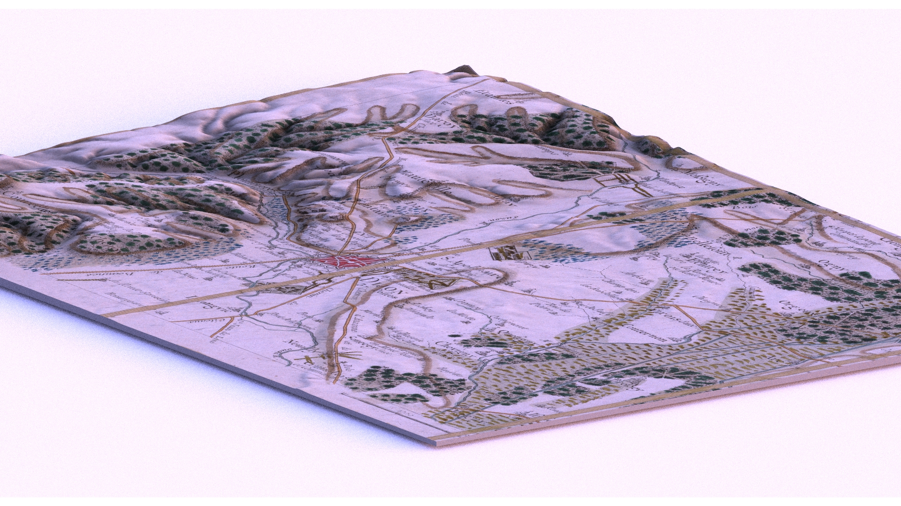

# Systèmes d'Information Géographique & Cartographie {#SIG}

::: {.infobox .caution data-latex="{caution}"}
**Work In Progress**
:::

## Qu'est-ce qu'un SIG ? {#whatis-sig}

<!-- TODO : Développer l'utilité des SIG dans les prises de décision --> 
<!-- 
    TODO : Ajouter des infos provenant de
    https://www.notre-planete.info/terre/outils/sig.php
-->

Un Système d'Information Géographique est, comme tout Système d'Information
[^SI], un ensemble organisé de ressources ayant pour fonction de collecter,
stocker, traiter et diffuser des informations [^SIG]. Ici, ces informations sont
des données géospatiales stockées sous forme de couches d'informations
superposées et reliées les unes aux autres par un référentiel cartographique
[^Référentiel]. Les SIG sont devenus des outils essentiels dans de nombreux
domaines tels que l'écologie, la météorologie, la médecine, ou la sociologie.

Pour aider les utilisateurs au traitement des données géospatiales, il existe de
performants et très utilisés logiciels gratuits ou payants tels que
[QGis](https://www.qgis.org/fr/site/) ou
[ArcGIS](https://www.arcgis.com/index.html). Ces logiciels offrent une approche
graphique à la lecture, l'écriture, la manipulation et la visualisation des
données. Ceci peut néanmoins limiter la **reproductibilité** et
l'**automatisation** des projets. Pour remédier à cela, de nombreux langages de
programmation peuvent être utilisés pour écrire et partager des scripts. Parmi
les plus utilisés, il y a [Python](https://www.python.org/) (qui est notamment
utilisé pour la conception de plugins dans les logiciels de SIG) et
[R](https://www.r-project.org/about.html) (dont les scripts sont maintenant
exécutables dans QGis). En plus de cela, l'approche en lignes de commande permet
de se libérer de certaines contraintes imposées par ces logiciels ainsi que
d'avoir plus de contrôle sur ce que l'ont fait (même si ces logiciels sont de
plus en plus performants).

[^SI]: Cf. le cours sur
[Openclassroom](https://openclassrooms.com/fr/courses/2100086-decouvrez-le-monde-des-systemes-dinformation).
[^SIG]: Cf. la page Wikipédia sur le
[Système d'Information Géographique](https://fr.wikipedia.org/wiki/Syst%C3%A8me_d%27information_g%C3%A9ographique).
[^Référentiel]: Fond de carte représentant un territoire géographique sur lequel
peuvent venir s'insérer de nouvelles données cartographiques.

## R en tant que SIG {#R-sig}

Afin d'avoir un bon aperçu et une bonne base sur l'utilisation de R en tant que
SIG, je vous invite à lire le livre *Geocomputation with R* de @geocomputation.
Ce livre est mis à jour régulièrement et consultable gratuitement à cette
adresse : <https://geocompr.robinlovelace.net/>. Si vous préférez le format
papier et/ou voulez soutenir les auteurs, il est bien sûr disponible à l'achat.

Ayant commencé à apprendre les analyses statistiques avec R, c'est naturellement
que je me suis tourné vers ce langage pour la cartographie et l'analyse des
données géospatiales. En effet, la communauté de R a créé de performants et
magnifiques packages de cartographie et de géocalcul libres, gratuits et bien
documentés. Je m'intéresserai donc de plus près à ce qu'offre par exemple Python
lorsque j'aurai maîtrisé suffisamment R. Un autre langage élégant et très récent
qui est à regarder de très près est [Julia](https://julialang.org/), qui offrira
certainement des packages rapides et performants au fur et à mesure de sa
maturité. Par ailleurs, même si des programmes manqueraient à R ou si d'autres
langages possèdent des programmes plus adaptés pour certaines tâches, des
packages R offrent la possibilité d'en faciliter l'accès. Par exemple, les
packages tels que [`Rcpp`](https://github.com/RcppCore/Rcpp) et
[`Reticulate`](https://rstudio.github.io/reticulate/) permettent l'utilisation
de programmes écrits respectivement en C++ et Python. Outre cela, depuis peu
j'ai eu le plaisir de voir un nouveau package émerger :
[`qgisprocess`](https://github.com/paleolimbot/qgisprocess). Ce package fournit
une interface pour pouvoir utiliser les algorithmes disponibles dans QGIS. Il
permet donc d'étendre les possibilités de R pour les SIG.

D'autres caractéristiques intéressantes de R sont sa flexibilité et sa constante
évolution. Par exemple, il offre maintenant la possibilité de faire facilement
des applications web et des cartes interactives notamment via les packages
[`Shiny`](https://shiny.rstudio.com/) et
[`Leaflet`](https://rstudio.github.io/leaflet/). Il offre par la même occasion
divers outils d'analyses avancées, de modélisation et de visualisation qui sont
mis à jour et améliorés régulièrement.

Pour plus d'informations concernant les atouts de R en tant que SIG ainsi qu'un
bref aperçu de l'utilité des autres langages tels que Python, Java et C++, je
vous invite à lire le chapitre [Why use R for
geocomputation](https://geocompr.robinlovelace.net/intro.html#why-use-r-for-geocomputation)
du livre de @geocomputation.

## La représentation des données : les *vecteurs* et les *rasters* {#data-sig}

Pour représenter numériquement les données spatiales, deux modèles de base sont
utilisés : les *vecteurs* (mode vectoriel) et les *rasters* (mode matriciel).
L'une des principales différences entre ces deux modèles est qu'un vecteur est
un *objet* (ou entité) tandis que le raster est une *image*. Ainsi, les vecteurs
sont constitués de points, de lignes et de polygones créés à partir d'équations
mathématiques, tandis que les rasters sont des grilles constituées de cellules
de même taille (les pixels). C'est cette différence qui fait que les vecteurs ne
perdent pas en netteté lorsque l'on zoome dessus, tandis que les images
(rasters) deviennent floues (elles « pixelisent »). Par ailleurs, la différence
dans la manière de stocker ces deux modèles fait que les fichiers liés aux
vecteurs ont une taille bien inférieure que ceux liés aux raster.  
Sous R, les vecteurs et les rasters sont travaillés respectivement avec les
packages `sf` et `raster`.

### Les vecteurs {#vectors}

Un vecteur est une image vectorielle ou dessin mathématique constitué de deux
composantes : une **composante attributaire** permettant de l'identifier, et une
**composante graphique** décrivant sa géométrie. Il est localisé grâce à un
Système de Coordonnées de Référence (ou CRS pour *Coordinate Reference System*
en anglais). Les vecteurs sont basiquement composés de nœuds ou sommets qui sont
des **points dans l'espace**. À partir de ces sommets, des **formules
mathématiques** sont appliquées pour créer des **formes géométriques**. S'il n'y
a qu'un sommet, le vecteur est simplement un point. S'il y a plusieurs sommets
et que les liaisons ne forment pas une forme géométrique fermée, alors cela
forme une ligne. Si la forme est fermée, le vecteur est un polygone. La
géométrie des points est généralement en deux dimensions ($x =$ longitude, $y =$
latitude), mais peut être parfois en trois dimensions si une valeur $z$
additionnelle est ajoutée (notamment pour représenter la hauteur au-dessus du
niveau de la mer).  
Les vecteurs permettent donc de représenter des **données discrètes** avec des
**formes bien définies dans l'espace**.

Pour stocker la géométrie de ces **entités géographiques**,
l'OGC [^OGC] ([*Open Geospatial Consortium*](https://www.ogc.org/)) a développé
un modèle standardisé pour les Bases de Données Spatiales (BDS). Ce modèle
s'appelle **Modèle d'Entité Simple** (SFA pour [*Simple Feature
Access*](https://www.ogc.org/standards/sfa) en anglais) et permet de définir des
fonctions pour accéder, faire des calculs et construire les données, dans le but
de représenter les objets dans la réalité. C'est un modèle de données très
largement supporté dans la plupart des logiciels SIG (dont QGIS) et a
l'avantage de rendre le travail totalement transférable d'un projet à un autre
grâce à une architecture commune.

Pour amener ce modèle dans R, le package `sf` a ainsi été créé pour succéder au
package `sp` sur le long terme [^sf-vignette]. Les différents **types de
géométrie** définis par la norme standardisée de l'OGC sont donc inclus dans ce
package (fig. \@ref(fig:plot-sf-types2)). Ces types de géométrie permettent de
créer les entités, qui sont la **représentation d'un objet dans le monde réel**
(comme un bâtiment, un champ ou un arbre). Chaque entité peut alors faire partie
par exemple du type `POINT`, `POLYLIGNE` (`LINESTRING`) ou `POLYGONE`. En plus
de cela, il est possible de créer d'autres entités à partir de l'agrégation de
ces entités basiques (formant des `MULITPOINTS`, des `MULTIPOLYLIGNES` et des
`MULTIPOLYGONES`). Une seule entité contenant plusieurs types de géométrie
différents est alors de type « collection de géométrie » (`GEOMETRYCOLLECTION`).

Ces 7 types de géométrie précédemment cités font partis des types les plus
utilisés. Ils peuvent être facilement créés avec le package `sf`. Il faut alors
savoir que :

```{r, message=FALSE, warning=FALSE}
library("sf")
```

- Un POINT est un vecteur :

```{r, collapse=TRUE}
POINT <- c(-0.25, 1)
st_point(POINT)
```

- Un MULTIPOINT est une matrice :

```{r, collapse=TRUE}
MULTIPOINT <- rbind(c(-0.25, 1), c(0.25, 1))
st_multipoint(MULTIPOINT)
```

- Un LINESTRING est une matrice :

```{r, collapse=TRUE}
LINESTRING <- rbind(c(-1, 1), c(-1, 2.5), c(0, 1.5))
st_linestring(LINESTRING)
```

- On peut alors créer un contour avec un LINESTRING qui se ferme :

```{r, collapse=TRUE}
LINESTRING_boundary <- rbind(c(-1, 1), c(-1, 2.5), c(0, 1.5), c(-1, 1))
st_linestring(LINESTRING_boundary)
```

- Un MULTILINESTRING est une liste de matrices :

```{r, collapse=TRUE}
MULTILINESTRING <- list(
  LINESTRING,
  rbind(c(1, 1), c(1, 2.5))
)
st_multilinestring(MULTILINESTRING)
```

- Un POLYGON est une liste de matrices :

```{r, collapse=TRUE}
POLYGON <- list(
  rbind(c(0, 0), c(-1, 1), c(0, 1.5), c(1, 1), c(0, 0))
)
st_polygon(POLYGON)
```

- Un MULTIPOLYGON est une liste de listes de matrices :

```{r, collapse=TRUE}
MULTIPOLYGONE <- list(
  POLYGON,
  list(rbind(c(-1, 1), c(-1, 2.5), c(0, 1.5), c(-1, 1))),
  list(rbind(c(1, 1), c(1, 2.5), c(0, 1.5), c(1, 1)))
)
st_multipolygon(MULTIPOLYGONE)
```

- Un GEOMETRYCOLLECTION est une liste de tous les autres types de géométrie :

```{r, collapse=TRUE}
GEOMETRYCOLLECTION <- list(
  st_multipolygon(MULTIPOLYGONE),
  st_multipoint(MULTIPOINT)
)
st_geometrycollection(GEOMETRYCOLLECTION)
```


```{r plot-sf-types1, echo=FALSE}
# Préparation des données pour la visualisation des types de géométrie.
type <- c(
  "POINT",
  "MULTIPOINT",
  "LINESTRING",
  "LINESTRING (fermé)",
  "MULTILINESTRING",
  "POLYGON",
  "MULTIPOLYGONE",
  "GEOMETRYCOLLECTION"
)

sf_type <- as.data.frame(type)

sfc <- st_sfc(
  st_point(POINT),
  st_multipoint(MULTIPOINT),
  st_linestring(LINESTRING),
  st_linestring(LINESTRING_boundary),
  st_multilinestring(MULTILINESTRING),
  st_polygon(POLYGON),
  st_multipolygon(MULTIPOLYGONE),
  st_geometrycollection(GEOMETRYCOLLECTION)
)

sf_type <- st_set_geometry(sf_type, sfc)
```


```{r plot-sf-types2, out.width="100%", echo=FALSE, fig.cap="Principaux types de géométries pour le Modèle d'Entité Simple (SFA)."}
ggplot(sf_type) +
  geom_sf(fill = "orange", colour = "black") +
  facet_wrap(vars(factor(type, levels = type)), ncol = 4) +
  theme_tufte() +
  theme(
    axis.text = element_blank(),
    axis.ticks = element_blank(), 
    panel.border = element_rect(colour = "black", fill = "transparent")
  )
```


Le package `sf` est multitâche, il permet de : lire et écrire des fichiers de
données spatiales via la bibliothèque
[GEOS](https://www.osgeo.org/projects/geos/) ; faire des opérations géométriques
via la bibliothèque [GDAL](https://gdal.org/) ; mais aussi représenter et
transformer des systèmes de coordonnées projetées, à partir de la
bibliothèque [PROJ](https://proj.org/).

#### Lecture des fichiers de données spatiales pour les vecteurs

Pour avoir un aperçu des objets `sf` sous R, nous allons prendre pour exemple
les données de localisation des Réserves Naturelles Nationales (RNN) de la
France métropolitaine (Tableau \@ref(tab:data-rnn)). Ces données proviennent de
l'Inventaire National du Patrimoine Naturel
([INPN](https://inpn.mnhn.fr/accueil/index)) et elles sont trouvables sur le
[site du gouvernement](https://www.data.gouv.fr/fr/datasets/inpn-donnees-du-programme-espaces-proteges/).

Plusieurs formats de fichier peuvent être utilisés pour stocker les données des
vecteurs. Les plus utilisés sont le format *Shapefile* (**.shp**) de la société
ESRI, les formats *Keyhole Markup Language* (**.kml**) de Google (et qui peut
être compressé sous le format **.kmz**), ou aussi le format *Geographic Markup
Language* (**.gml**) développé par l'OGC.

Concernant les données spatiales des RNN, elles sont téléchargeables au format
*Shapefile*. Il faut alors savoir que le format *Shapefile* est toujours
accompagné d'autres fichiers, dont les plus importants sont le fichier **.dbf**
contenant les données attributaires, ainsi que le fichier **.shx** contenant
l'index de la géométrie. Le fichier **.shp** contient, lui, les caractéristiques
géométriques des différentes entités. C'est pour cela que lorsqu'on télécharge
des données au format *Shapefile*, on télécharge en réalité tout un dossier
contenant plusieurs fichiers.

Une fois le package `sf` chargé, pour lire les données spatiales il faut
utiliser la fonction `st_read()`. Pour cet exemple, il suffit alors de lui
donner le chemin d'accès au fichier **.shp**. Les autres fichiers qui lui sont
liés doivent être stockés au même endroit. Pour plus d'informations sur les
différents paramètres et les différentes possibilités de cette fonction, il ne
faut pas hésiter à aller lire sa documentation.

```{r load-rnn, warning=FALSE, message=FALSE, collapse=TRUE}
# Lecture de la base de données
data_rnn <- st_read("examples/rnn2019_12/N_ENP_RNN_S_000.shp")
```

Des informations importantes sont alors affichées après lecture du fichier. On
peut y lire dans l'ordre : la couche spatiale utilisée ainsi que le chemin
d'accès du fichier source ; le type de l'objet ainsi créé et sa courte
description ; le type de géométrie des différentes entités ; les dimensions
spatiales ; les coordonnées délimitant la zone géographique (*bounding box*) ;
et enfin le Système de Coordonnées de Référence.

En regardant l'objet `sf` alors créé, on peut s'apercevoir qu'il a la forme d'un
tableau de données comme on a l'habitude de voir. Cette caractéristique permet
de le manipuler facilement, notamment via le package
[`dplyr`](http://larmarange.github.io/analyse-R/manipuler-les-donnees-avec-dplyr.html).
En réalité, cet objet est bien de classe `data.frame`, mais il possède en plus
la classe `sf` du fait de sa dernière colonne : `geometry`. Cette colonne est
une liste contenant la géométrie des différentes entités de la couche. La liste
entière est de classe `sfc` (*simple feature list-column*) et chaque élément de
cette liste est de classe `sfg` (*simple feature geometry*).

Cette structure de données possède donc bien la composante graphique des
vecteurs (colonne `geometry`) ainsi que leur composante attributaire (toutes les
autres colonnes).

<caption>(#tab:data-rnn) Jeu de données spatiales montrant les Réserves Naturelles Nationales de la France métropolitaine. </caption>

```{r data-rnn, echo=FALSE}
my_reactable(
  data_rnn,
  pagination = TRUE,
  pageSizeOptions = c(5, 10, 15, 20),
  showPageSizeOptions = TRUE
)
```

<br>

On peut visualiser les attributs de l'objet `data_rnn` à l'aide de la fonction
`attributes` :

```{r str-data-rnn1, collapse=TRUE}
attributes(data_rnn)
```

De même pour la colonne `geometry` :

```{r str-data-rnn2, collapse=TRUE}
attributes(data_rnn$geometry)
```

Parfois, il peut être utile de récupérer le Système de Coordonnées de Référence
dans un autre format : le format `proj4string`. Cette notation provient de la
librairie [PROJ](https://proj.org/) (anciennement PROJ.4). Elle permet de
définir le Système de Coordonnées directement à l'intérieur d'une chaîne de
caractères. Pour l'instant, le nom `proj4string` est resté dans R, mais dans la
[documentation officielle](https://proj.org/usage/quickstart.html) le nom de
cette notation est maintenant `proj-string`.

Par exemple, ici le `proj4string` vaut :

```{r str-data-rnn3, collapse=TRUE}
st_crs(data_rnn)$proj4string
```

#### Création de cartes à partir de vecteurs

```{r data-plot-rnn, message=FALSE, warning=FALSE}
library("ggspatial") # Extension de ggplot2 pour la cartographie

# Ajout des départements français.
regions <- st_read("examples/regions-20180101-shp/regions-20180101.shp") %>%
  filter(code_insee %in% 1:95)

# Les données ne sont pas dans le bon référentiel (WGS 84).
# La projection Lambert 93 du référentiel RGF93 a pour référence EPSG:2154.
# regions <- st_transform(regions, 2154)

data_rnn <- st_transform(data_rnn, 4326)

# Ajout des coordonnées dans le tableau pour faciliter la création des labels
# Vu que ce sont des polygones, on calcule leur centre pour avoir un point.
data_rnn <- cbind(data_rnn, st_coordinates(st_point_on_surface(data_rnn)))
```


```{r ggplot-rnn-1, message=FALSE, warning=FALSE}
# Localisation des réserves en France métropolitaine
rnn_france <- ggplot(regions) +
  annotation_map_tile(
    zoom = 5, 
    zoomin = 0,
    type = "stamenwatercolor", 
    progress = "none"
  ) +
  geom_sf(
    aes(fill = nom),
    colour = "black",
    alpha = 0.6,
    show.legend = FALSE
  ) +
  # Lien entre cartes non-zoomée et zoomée
  geom_diagonal(
    aes(x = 14, xend = 12.5, y = 46, yend = 47.2)
  ) +
  geom_label_repel(
    seed = 42,
    data = filter(data_rnn, ID_LOCAL == "RNN112"),
    aes(x = X, y = Y, label = "Haute Chaîne\ndu Jura"),
    size = 4,
    nudge_x = 6,
    nudge_y = 1.2,
    segment.curvature = 0.5,
    segment.ncp = 1,
    segment.angle = 10,
  ) +
  geom_point(
    data = data_rnn,
    aes(x = X, y = Y),
    colour = "darkred",
    size = 2
  ) +
  annotation_north_arrow(
    location = "bl",
    which_north = "true",
    style = north_arrow_nautical()
  ) +
  coord_sf(datum = st_crs(4326)) +
  theme_linedraw() +
  theme(
    panel.ontop = TRUE,
    panel.background = element_blank(),
    axis.title = element_blank()
  )
```

```{r ggplot-rnn-2, message=FALSE, warning=FALSE}
# On récupère les limites inférieures et supérieures de la RNN de la haute
# chaîne du Jura.
crop_limits <- st_bbox(filter(data_rnn, ID_LOCAL == "RNN112"))

# On zoome sur la carte des régions en augmentant les limites précédentes
# par 10 km.
crop_regions <- st_crop(regions, crop_limits + c(-0.1, -0.1, 0.15, 0.1))

rnn_jura <- ggplot(crop_regions) +
  annotation_map_tile(zoomin = -1, type = "stamenwatercolor", progress = "none") +
  geom_sf(data = crop_regions, colour = "black", fill = NA, size = 1.05) +
  geom_sf(data = filter(data_rnn, ID_LOCAL == "RNN112"), fill = "darkred") +
  coord_sf(expand = FALSE, datum = st_crs(4326)) +
  theme_map() +
  theme(
    panel.border = element_rect(colour = "black", fill = NA, size = 2),
    panel.ontop = TRUE
  )
```

(ref:fig-rnn) Carte montrant la localisation géographique (point rouge) des Réserves Naturelles Nationales de la France métropolitaine. Un zoom a été fait pour apercevoir la délimitation de la Réserve Nationale de la Haute Chaîne du Jura.

```{r fig-rnn, fig.cap='(ref:fig-rnn)', message=FALSE, warning=FALSE, out.width="100%"}
layout_design <- c(
  area(t = 1, l = 1, b = 8, r = 7),
  area(t = 5, l = 6, b = 8, r = 8)
)

rnn_france + rnn_jura + 
  plot_layout(design = layout_design) +
  plot_annotation(caption = "\u00a9 OpenStreetMap contributors")
```

[^OGC]: L'OGC est un consortium international qui développe des standards ouverts
(OpenGIS) dans les domaines de la géomatique et de l'information géographique.

[^sf-vignette]: Cf. la [vignette](https://r-spatial.github.io/sf/articles/sf1.html)
du package `sf` parlant de ce sujet.

### Les rasters {#rasters}

Un raster représente une image constituée de pixels (cellules) organisé(e)s sous
la forme d'une grille. C'est la représentation que l'on a l'habitude de voir
lorsque l'on parle d'une image numérique. Chaque pixel est unique et possède
certaines valeurs le caractérisant (comme sa couleur, ses coordonnées, son
altitude...). Les données sont ainsi organisées en **matrice**, où chaque
**cellule** correspond à un pixel. Pour bien superposer le raster à la carte,
les matrices possèdent une en-tête incluant le **Système de Coordonnées de
Référence**, **l'origine** (généralement les coordonnées du coin inférieur droit
de la matrice), ainsi que l'**étendue de la matrice** (le nombre de colonnes, de
lignes et la résolution spatiale [^resolution]).  
De par leurs caractéristiques, les rasters permettent de définir des **données
discrètes** ainsi que des **données continues**.

[^resolution]: Globalement, la résolution spatiale est la **taille réelle du
plus petit élément** représenté dans un jeu de données. Pour le *mode
matriciel*, cela **correspond à la taille de la cellule de la grille**. Par
exemple, si une cellule représente une surface réelle de 10 x 10 m, alors la
résolution est de 10 m. La résolution spatiale permet donc de **définir le
niveau de détail** du jeu de données. La netteté de l'image est ainsi dépendante
de la résolution spatiale puisqu'il y aura plus de détails capturés avec des
cellules de petite taille (résolution élevée ou fine) qu'avec des cellules de
grande taille (résolution basse ou grossière).

## Les Systèmes de Coordonnées de Référence Géographiques et Projetées {#CRS}

## Les cartes interactives {#cartes-interactives}

### Le package **`ggiraph`**

```{r}
library("ggiraph")
```

```{r code-rnn-jura-interactive, cache=TRUE, message=FALSE, warning=FALSE}
# Communes du pays de Gex
pays_de_gex <- st_read("examples/communes-pays-de-gex/communes-pays-de-gex.shp")

rnn_jura_interactive <- ggplot(crop_regions) +
  annotation_map_tile(zoomin = -1, type = "stamenwatercolor", progress = "none") +
  geom_sf(data = crop_regions, colour = "black", fill = NA, size = 1.1) +
  geom_sf(
    data = filter(data_rnn, ID_LOCAL == "RNN112"), 
    fill = "darkred",
    colour = "darkred"
  ) +
  geom_sf_interactive(
    data = pays_de_gex, 
    aes(tooltip = nom, data_id = insee),
    colour = "black", 
    fill = "black",
    alpha = 0.3
  ) +
  labs(caption = "© OpenStreetMap contributors") +
  coord_sf(expand = FALSE, datum = st_crs(4326)) +
  theme_map() +
  theme_linedraw() +
  theme(
    panel.ontop = TRUE,
    panel.background = element_blank(),
    axis.title = element_blank()
  )
```

```{r, eval=FALSE}
girafe(
  code = print(rnn_jura_interactive),
  options = list(
    opts_hover(css = "fill:orange;"),
    opts_hover_inv(css = "opacity:0.2;"),
    opts_zoom(max = 5)
  )
)
```

(ref:plot-rnn-jura-interactive) Carte de la délimitation (en rouge) de la Réserve Naturelle Nationale de la Haute-Chaîne du Jura. Le nom des communes de la Communauté d'Agglomération du Pays de Gex est visible interactivement en passant dessus le curseur de la souris.

```{r plot-rnn-jura-interactive, fig.height="600px", out.width="100%", message=FALSE, warning=FALSE, echo=FALSE, fig.cap="(ref:plot-rnn-jura-interactive)"}
if (!file.exists("docs/images/plot-rnn-jura-interactive.html")) {
  girafe(
    code = print(rnn_jura_interactive),
    options = list(
      opts_hover(css = "fill:orange;"),
      opts_hover_inv(css = "opacity:0.2;"),
      opts_zoom(max = 5)
    )
  ) %>%
  htmlwidgets::saveWidget(
    file = here::here("images", "plot-rnn-jura-interactive.html"),
    selfcontained = TRUE
  )
}
knitr::include_url("images/plot-rnn-jura-interactive.html")
```

### Le package *`leaflet`*

```{r, message=FALSE, warning=FALSE}
library("leaflet")
library("leafem")
```


```{r}
map_types <- c(
  "Esri.NatGeoWorldMap",
  "OpenTopoMap",
  "GeoportailFrance.maps",
  "GeoportailFrance.orthos",
  "OpenStreetMap.France"
)

description_rnn <- data_rnn %>%
  st_drop_geometry() %>%
  select(NOM_SITE, DATE_CREA, OPERATEUR, SURF_OFF, ID_MNHN, URL_FICHE) %>%
  mutate(
    description = glue(
      '
      <h1 style="border: 3px solid; text-align: center; border-radius: 15px">
      {NOM_SITE}
      </h1>
      <b>Date de création</b> : {format(DATE_CREA, "%d/%m/%Y")}<br>
      <b>Opérateur</b> : {OPERATEUR}<br>
      <b>Superficie officielle</b> : {SURF_OFF} ha<br>
      <b>Identifiant du MNHN</b> : {ID_MNHN}<br>
      <b>Lien</b> : <a href={URL_FICHE}>{URL_FICHE}</a><br>
      '
    )
  ) %>%
  pull(description)
```

<br>

```{r leaflet, warning=FALSE, message=FALSE}
pal = colorNumeric(viridis::viridis(length(data_rnn$SURF_OFF)), data_rnn$SURF_OFF)

carte <- leaflet() %>%
  addFeatures(
    data = data_rnn,
    color = "black",
    weight = 1,
    opacity = 1,
    fillOpacity = 0,
    label = ~NOM_SITE,
    popup = description_rnn,
    group = "Contours"
  ) %>%
  addFeatures(
    data = st_point_on_surface(data_rnn),
    color = "black",
    weight = 1,
    fillColor = ~viridis::viridis(length(SURF_OFF)),
    opacity = 0.8,
    fillOpacity = 0.8,
    label = ~NOM_SITE,
    popup = description_rnn,
    group = "Points1",
    bringToFront = TRUE
  ) %>%
  addLegend(
    data = data_rnn,
    position = "bottomleft", 
    pal = pal,
    values = ~SURF_OFF,
    title = "Surface (m²)",
    opacity = 1
  ) %>%
  addLayersControl(
    baseGroups = c(map_types),
    overlayGroups = c("Points1", "Contours")
  ) %>%
  addMouseCoordinates() %>%
  addHomeButton(st_bbox(data_rnn), "Retour", position = "topright") %>%
  addMiniMap(toggleDisplay = TRUE)
  

for (provider in map_types) {
  carte <- addProviderTiles(carte, provider, group = provider)
}
```

<br>

(ref:plot-leaflet) Carte interactive montrant la localisation et le contour des Réserves Naturelles Nationales en France métropolitaine.

```{r plot-leaflet, out.width="100%", fig.cap="(ref:plot-leaflet)", warning=FALSE, message=FALSE, echo=FALSE}
mapview::mapshot(
  carte,
  here::here("images", "plot-leaflet.html"), 
  remove_controls = NULL,
  selfcontained = FALSE # Les lourds fichiers HTML ne peuvent être indépendants
)

# Pour le moment, il faut copier manuellement les dépendances du fichier HTML
# vers le dossier /docs
fs::dir_copy("images/plot-leaflet_files/", "docs/images/plot-leaflet_files/")
knitr::include_url("images/plot-leaflet.html")
```

## Les cartes en 3D avec **`rayshader`**

```{r, eval=FALSE}
library("rayshader")
library("raster")
```

```{r, eval=FALSE}
# Zone géographique d'intérêt.
boundary_box <- extent(
  843442,
  866595,
  6686564,
  6703526
)

# Chargement de la carte historique de Dijon.
cassini <- stack("examples/3d_map/dijon/Carte_générale_de_la_France_Dalier_(17_btv1b53095148b_1_georef.tif")

# Recadrage sur la zone d'intérêt.
cassini_croped <- crop(cassini, boundary_box)

# Visualisation du raster RGB.
plotRGB(cassini_croped)
```

(ref:plotrgb-dijon-cassini) Carte 2D en couleur de Cassini (XVIII^e^ siècle) montrant la ville de Dijon en France.

```{r plotrgb-dijon-cassini, echo=FALSE, out.width="100%", fig.cap="(ref:plotrgb-dijon-cassini)"}

```

```{r, eval=FALSE}
# Transformation en array
cassini_array <- as.array(cassini_croped)
```

```{r, eval=FALSE}
# Chargement de la carte d'élévation.
dijon_topo <- raster("examples/3d_map/dijon/BDALTIV2_75M_FXX_0825_6750_MNT_LAMB93_IGN69.asc")
crs(dijon_topo) <- CRS("+init=EPSG:2154")
dijon_topo <- crop(dijon_topo, boundary_box) %>% raster_to_matrix()
```

```{r, eval=FALSE}
# Création des couches pour les ombres
ray_layer <- ray_shade(dijon_topo, zscale = 20, multicore = TRUE)

ambient_layer <- ambient_shade(
  dijon_topo,
  zscale = 10,
  multicore = TRUE,
  maxsearch = 200
)
```

```{r, eval=FALSE}
# On divise par 255 pour avoir des valeurs entre 0 et 1.
# (L'étendue des couleurs RGB est en effet entre 0 et 255.)

# Carte en 3D en vue de dessus, avec la fonction `plot_map`
(cassini_array/255) %>%
  add_shadow(ray_layer, 0.3) %>%
  add_shadow(ambient_layer, 0) %>%
  plot_map()
```

(ref:plot2d-dijon-cassini) Carte de Cassini (XVIII^e^ siècle) en 3D et en vue de dessus, montrant la ville de Dijon en France.

```{r plot2d-dijon-cassini, echo=FALSE, out.width="100%", fig.cap="(ref:plot2d-dijon-cassini)"}
knitr::include_graphics("images/3d_map_export/dijon_cassini_2d.jpeg")
```

```{r, eval=FALSE}
# Carte en 3D avec la fonction `plot_3d` permettant de changer la position de la caméra.
(cassini_array/255) %>%
  add_shadow(ray_layer, 0.3) %>%
  add_shadow(ambient_layer, 0) %>%
  plot_3d(dijon_topo, zscale = 30)

# On crée une vue de dessus.
# Je mets ici -90 car la fonction `render_highquality` va inverser cette valeur,
# je ne sais pas si c'est un bug (-90 deviendra la bonne valeur : 90).
render_camera(
  zoom  = 0.5,
  phi   = -90,  # Angle d'azimut (max 90)
  theta = 0   # Angle de rotation
)

render_highquality(
  lightaltitude = 25,
  environment_light = "examples/3d_map/HDRI/kiara_1_dawn_4k.hdr"
)
```

(ref:plot3d-dijon-cassini1) Carte de Cassini (XVIII^e^ siècle) en 3D et en vue de dessus, montrant la ville de Dijon en France. Le rendu de la lumière est ici de meilleure qualité.

```{r plot3d-dijon-cassini1, echo=FALSE, out.width="100%", fig.cap="(ref:plot3d-dijon-cassini1)"}
knitr::include_graphics("images/3d_map_export/dijon_cassini.jpeg")
```

```{r, eval=FALSE}
# zscale plus élevé
(cassini_array/255) %>%
  add_shadow(ray_layer, 0.3) %>%
  add_shadow(ambient_layer, 0) %>%
  plot_3d(dijon_topo, zscale = 60)

# On positionne la caméra sur le côté.
render_camera(
  zoom  = 0.3,
  phi   = 15,  # Angle d'azimut (max 90)
  theta = 55   # Angle de rotation
)
```

```{r, eval=FALSE}
# Meilleure qualité
render_highquality(
  light = TRUE,
  lightaltitude = 25,
  environment_light = "examples/3d_map/HDRI/kiara_1_dawn_4k.hdr"
)
```

(ref:plot3d-dijon-cassini2) Carte de Cassini (XVIII^e^ siècle) en 3D montrant la ville de Dijon en France. La caméra a été déplacée pour avoir une vue sur le côté.

```{r plot3d-dijon-cassini2, echo=FALSE, out.width="100%", fig.cap="(ref:plot3d-dijon-cassini2)"}

```

```{r, eval=FALSE}
# On rajoute de la profondeur de champs (bokeh)
render_depth(
  focus = 0.52,
  environment_light = "examples/3d_map/HDRI/kiara_1_dawn_4k.hdr"
)
```

(ref:bokeh-dijon-cassini) Carte de Cassini (XVIII^e^ siècle) en 3D montrant la ville de Dijon en France. La profondeur de champ a été ajoutée pour créer un effet *bokeh*.

```{r bokeh-dijon-cassini, echo=FALSE, out.width="100%", fig.cap="(ref:bokeh-dijon-cassini)"}
knitr::include_graphics("images/3d_map_export/dijon_cassini_bokeh.jpeg")
```

```{r, eval=FALSE}
# Caméra pour la vidéo
render_camera(
  zoom  = 0.3,
  phi   = 25,  # Angle d'azimut (max 90)
  theta = 0   # Angle de rotation
)

render_movie(
  "images/3d_map_export/dijon_3d_audio",
  type = "oscillate",
  frames = 720,
  audio = "examples/3d_map/musique/jacques-gallot-suite-in-f-sharp-minor-prelude-a-magical-music.mp3"
)
```

<!-- FIXME Trouver un moyen d'ajouter une légende référencée à la vidéo. -->

<!-- (ref:video-dijon-cassini) Vidéo de la carte de Cassini (XVIII^e^ siècle) en 3D montrant la ville de Dijon en France. <br> *(Audio : Prélude de la suite en Fa dièse majeur, Jacques de Gallot.)* -->

<!-- ```{r video-dijon-cassini, echo=FALSE, fig.cap="(ref:video-dijon-cassini)", out.width="100%"} -->
<!-- knitr::include_url("images/3d_map_export/dijon_cassini_3d_audio.html") -->
<!-- ``` -->

Vidéo de la carte de Cassini (XVIII^e^ siècle) en 3D montrant la ville de Dijon en France.
*(Audio : Prélude de la suite en Fa dièse majeur, Jacques de Gallot.)*

<video loop="true" controls>
  <source src="images/3d_map_export/dijon_cassini_3d_audio.mp4"
          type="video/mp4">
  <p>Sorry, your browser doesn't support embedded videos.</p>
</video>

***

## Liste de ressources Internet utiles {.unnumbered #ref-sig}

<!-- TODO : Séparer les ressources de packages R pour plus de lisibilité -->

* [Guide](https://geocompr.robinlovelace.net/) sur les analyses de données
géographiques, leur visualisation et leur modélisation sur R
* [Introduction](https://statnmap.com/2018-07-14-introduction-to-mapping-with-sf-and-co/)
à l'utilisation des packages de cartographie sur R
* [Introduction](https://www.infoworld.com/article/3505897/how-to-do-spatial-analysis-in-r-with-sf.amp.html)
au package `sf`
* [Édition](https://github.com/r-spatial/mapedit) interactive de cartes avec
`mapedit`
* [introduction](https://mhallwor.github.io/_pages/welcome) à l'utilisation de R
comme un SIG
* [Introduction](http://eriqande.github.io/rep-res-web/lectures/making-maps-with-R.html)
pour créer des cartes avec R
* [Introduction](https://thinkr.fr/sil-te-plait-dessine-moi-carte-r/)
en français pour créer des cartes avec R
* Introduction en français sur le package 
[`rgeoapi`](https://colinfay.me/carte-r-rgeoapi-ggplot2/)
* [Zoomer](https://rgeomatic.hypotheses.org/tag/sf) sur une carte avec R
* [Tracer des cartes avec `ggplot2`](https://rpubs.com/huanfaChen/ggplotShapefile)
via des fichiers *shapefiles*
* [Tutoriel](https://www.r-spatial.org/r/2018/10/25/ggplot2-sf.html)
pour dessiner des cartes avec R, `sf` et `ggplot2`
* [Cartes interactives](https://r-spatial.github.io/mapview/) avec `mapview`
* [Cartes interactives](https://rstudio.github.io/leaflet/) avec `leaflet`
* Guide pour faire des
[cartes en 3D](https://www.tylermw.com/a-step-by-step-guide-to-making-3d-maps-with-satellite-imagery-in-r/)
à partir d'une imagerie satellite
* Utilisation du package [`rayshader`](https://www.rayshader.com/) pour la
création de cartes en 2D et 3D
* Manipulation et visualisation de données
[LiDAR](https://github.com/Jean-Romain/lidR) pour la foresterie avec `lidr`
* [Blog français](https://www.sigterritoires.fr/index.php/concepts/) contenant
divers tutoriels sur la SIG et QGis
* [NaturaGIS](https://naturagis.fr/) : tutoriels et ressources sur la géomatique, les SIG et leurs usages pour l'environnement
* [Documentation officielle](https://docs.qgis.org/3.10/fr/docs/) de QGIS
